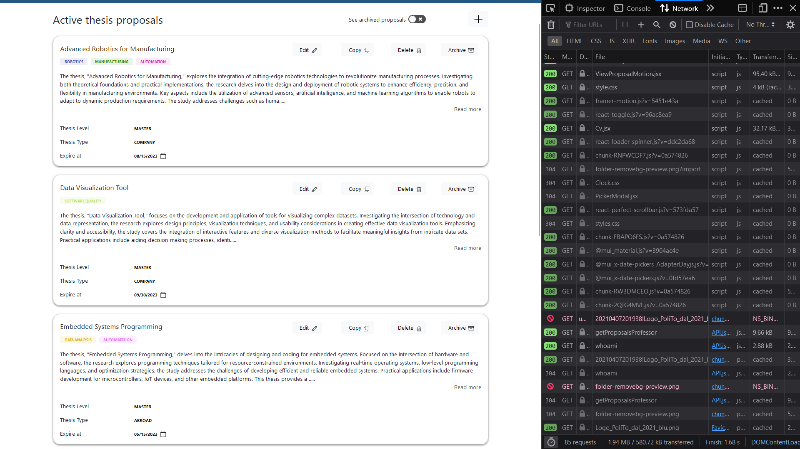
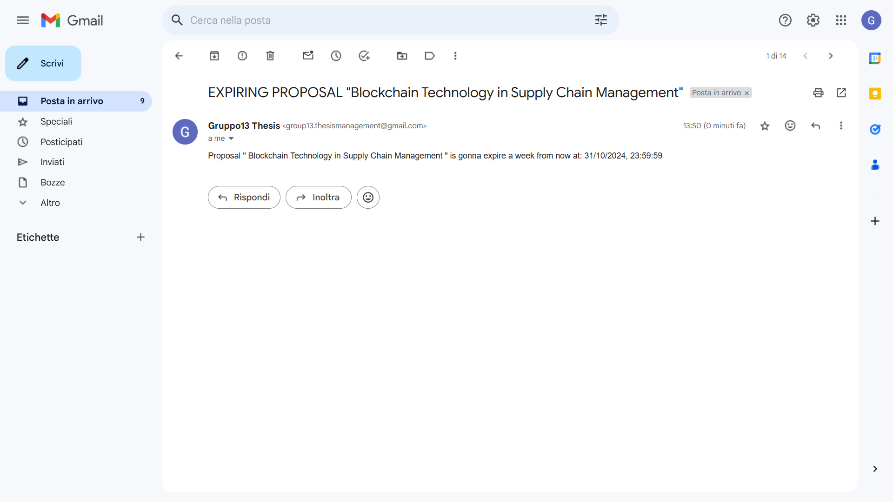
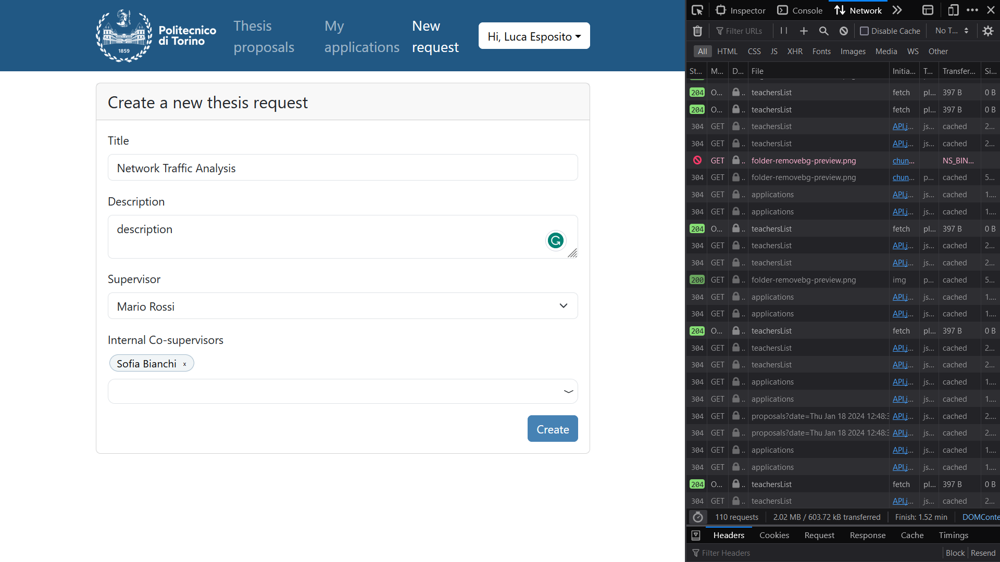

# e2e testing

## Contents

- [Homepage and login](#homepage-and-login)
- [US01 - Insert Proposal](#us01---insert-proposal)
- [US02 - Search Proposals](#us02---search-proposals)
- [US03 - Apply for Proposal](#us03---apply-for-proposal)
- [US04 - Browse Applications](#us04---browse-applications)
- [US05 - Accept Application](#us05---accept-application)
- [US06 - Browse Applications Decisions](#us06---browse-applications-decisions)
- [US07 - Browse Proposals](#us07---browse-proposals)
- [US08 - Update Proposal](#us08---update-proposal)
- [US09 - Notify Application Decision](#us09---notify-application-decision)
- [US10 - Delete Proposal](#us10---delete-proposal)
- [US11 - Copy Proposal](#us11---copy-proposal)
- [US12 - Archive Proposal](#us12---archive-proposal)
- [US13 - Access applicant CV](#us13---access-applicant-cv)
- [US14 - Notifty Application](#us14---notifty-application)
- [US15 - Proposal expiration](#us15---proposal-expiration)
- [US18 - Notify Expiration](#us18---notify-expiration)
- [US26 - Insert Student Request](#us26---insert-student-request)
- [US27 - Secretary Approve Student requests](#us27---secretary-approve-student-requests)
- [US28 - Professor Approve Student requests](#us28---professor-approve-student-requests)
- [US29 - Notify Professor Thesis Request](#us29---notify-professor-thesis-request)

## Homepage and login

*Home page for guest users*
 
 
 

*Login form*
 
 
 

*Student login*
 
 
 

)
*Home page for autenticated students*
 
 
 

*Professor login*
 
 
 

*Home page for autenticated professors*
 
 
 

*Log out*
 
 
 

## US01 - Insert Proposal

*Insert proposal by professor*
 
 
 

## US02 - Search Proposals

*Search by students in proposals generally or by different fields*
 
 
 

## US03 - Apply for Proposal

*Apply for a thesis and attach extra files *
 
 
 

## US04 - Browse Applications

*Browse applications of students for each proposal and see or download attachment*
 
 
 

## US05 - Accept Application

*Accept/reject an application by the supervisor*
 
 
 

## US06 - Browse Applications Decisions

*Application status before & after accepting by the supervisor in student's portal*
 
 
 

## US07 - Browse Proposals

*Browse in active proposals by professor*
 
 
 

## US08 - Update Proposal

*Update active proposals by professor*
 
 
 

## US09 - Notify Application Decision

*Notify a student on application's decision*
 
 
 

## US10 - Delete Proposal

*Delete a proposal by professor*
 
 
 

## US11 - Copy Proposal

*Copy a proposal by professor*
 
 
 

## US12 - Archive Proposal

*Archive a proposal by professor*
 
 
 

## US13 - Access applicant CV

*Acessing an applicant's CV*
 
 
 

## US14 - Notifty Application

*Notify a professor about new application*
 
 
 

## US15 - Proposal expiration

*Automatically archive expired proposals*
 
 
 

## US18 - Notify Expiration

*Notify a professor one week before expiration*
 
 
 

## US26 - Insert Student Request

*Inserting a thesis start request*
 
 
 

## US27 - Secretary Approve Student requests

*Secretary approves/rejects a thesis start request*
 
 
 

## US28 - Professor Approve Student requests

*Professor approves/rejects a thesis start request*
 
 
 

## US29 - Notify Professor Thesis Request

*Notify a professor about a new thesis start request*
 
 
 